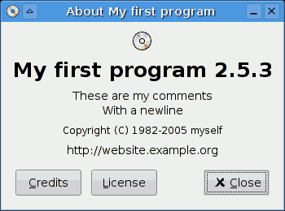

# PHP 소개

## 간단한 소개
PHP (ecursive acronym for PHP: Hypertext Preprocessor)는 널리 사용되는 오픈소스 스크립트 언어입니다. 특히 HTML에 포함되어 실행될 수도 있는 웹과 관련된 개발에 특화된 언어입니다.
예를 들어 아래와 같이 사용할 수 있습니다. 물론 단독의 코드로도 이용 가능합니다.

예제
```php
<!DOCTYPE html>
<html>
    <head>
        <title>Example</title>
    </head>
    <body>

        <?php
            echo "Hi, I'm a PHP script!";
        ?>
    </body>
</html>
```

위 예제는 HTML에 PHP 코드가 포함되어 "Hi, I'm a PHP script!"라는 문자을 웹브라우즈에 출력합니다.
위와 같이 HTML에 코드를 포함할 경우 반드시 "<?php"와 "?>"로 묶어주어야 합니다.

HTML에 포함되지 않을 경우 아래와 같이 별도의 파일로 저장 실행할 수 있습니다. 이 경우 "?>"는 생략할 수도 있습니다.
위와 같이 HTML에 포함되었다고 해서 브라우즈에서 실행하는 것은 아닙니다.
```php
<?php
    echo "Hi, I'm a PHP script!";
?>
```
PHP는 서버에서 실행되는 스크립트입니다. 서버에서 위 코드가 실행되어 실행 결과가 HTML에 포함되어 클라이언트에 전송됩니다. 클라이언트는 전송된 내용을 브라우즈에 출력하게 됩니다.

## PHP의 특징
1. PHP는 다양한 목적으로 널리 사용되고 있는 스크립트 언어입니다.
2. PHP는 웹관련 개발에 특화된 언어입니다.
3. PHP는 서버에서 동작하는 스크립트 언어입니다.
4. PHP는 HTML에 포함될 수 있습니다.

## PHP로 무엇을 할 수 있을까?
한마디로 "무엇이든 할수 있습니다."라고 할 수 있습니다. 과거 CGI 프로그램이 할 수 있었든 폼 양식을 통한 데이터 수집, 동적 페이지 생성, 쿠키정보 송/수신 등 뿐만 아니라 더 많은 작업들을 할 수 있습니다.

### PHP가 사용되는 3가지 영역
* **서버 스크립팅** : 이 영역은 이미 매우 전통적인 영역입니니다. 앞에서도 언급했듯이 실행결과를 웹 서비스 데몬을 통해 클라이언트로 전송하여 브라우즈를 통해 출력되도록 하는 웹 서비스 영역입니다.
* **명령줄 스크립팅** : 서버나 브라우즈 없이 명령줄을 통해 실행되는 응용프로그램을 작성할 수도 있습니다. 즉 클라이언트 축에서도 실행 가능한 프로그램을 작성할 수 있습니다. 단 이 경우 PHP 파서(코드/명령 분석기)가 필요합니다. 이 영역은 특정 서비스 관리용 프로그램이나 작업 스케즐링 프로그램 등에 이상적입니다.
* **데스크 응용프로그램 작성** : PHP-GTK라는 확장 모듈을 이용하면 아래 그림과 같은 GUI 응응프로그램 작성도 가능합니다. 아쉽게도 이 확장 모듈은 주 배포판에는 포함되어 있지 않습니다. 필요한 경우 PHPGTK (http://gtk.php.net/)에서 내려받아 설치해야 합니다.<br/>아래의 그림은 이 확장 모듀릉 이용한 대화상자입니다.<br/>

PHP는 대부분의 운영체제(Unix, Linux, Mac, Windows 등)에서 사용할 수 있습니다. 그리고 PHP는 대부분의 웹 응용프로그램 서비스를 지원합니다. 예를 들어 Apache, Nginx, IIS 등에서 문제 없이 동작합니다. PHP는 웹 기술 중 하나인 CGI 프로세스로 동작합니다.

PHP를 사용하면 HTML 출력으로 제한되지 않습니다. PHP의 기능에는 즉석에서 생성 된 이미지, PDF 파일 및 Flash 동영상 (libswf 및 Ming 사용) 출력이 포함됩니다. XHTML 및 기타 XML 파일과 같은 텍스트를 쉽게 출력 할 수도 있습니다. PHP는 이러한 파일을 자동 생성하고 인쇄하는 대신 파일 시스템에 저장하여 동적 콘텐츠에 대한 서버 측 캐시를 형성 할 수 있습니다.

PHP에서 가장 강력하고 중요한 기능 중 하나는 광범위한 데이터베이스에 대한 지원입니다 . 데이터베이스 지원 웹 페이지를 작성하는 것은 데이터베이스 특정 확장 (예 : mysql ) 중 하나를 사용 하거나 PDO 와 같은 추상화 계층을 사용 하거나 ODBC 확장을 통해 Open Database Connection 표준을 지원하는 데이터베이스에 연결하는 매우 간단 합니다. 다른 데이터베이스는 CouchDB와 같은 cURL 또는 소켓을 사용할 수 있습니다 .

PHP는 또한 LDAP, IMAP, SNMP, NNTP, POP3, HTTP, COM (Windows) 및 기타 수많은 프로토콜을 사용하여 다른 서비스와 통신 할 수 있도록 지원합니다. 원시 네트워크 소켓을 열고 다른 프로토콜을 사용하여 상호 작용할 수도 있습니다. PHP는 거의 모든 웹 프로그래밍 언어 간의 WDDX 복잡한 데이터 교환을 지원합니다.

PHP에는 Perl 호환 정규식 ( PCRE ) 과 XML 문서 를 구문 분석하고 액세스 하기위한 많은 확장 및 도구를 포함하는 유용한 텍스트 처리 기능이 있습니다 .

